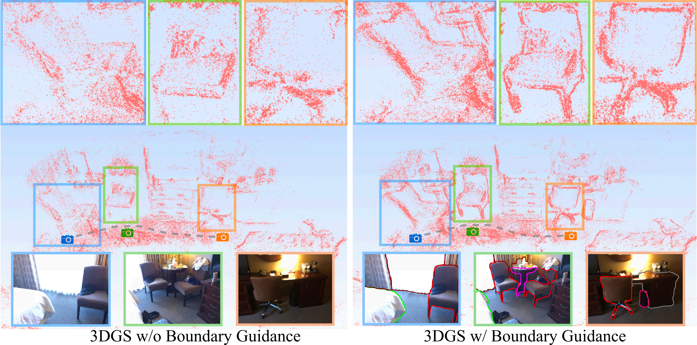
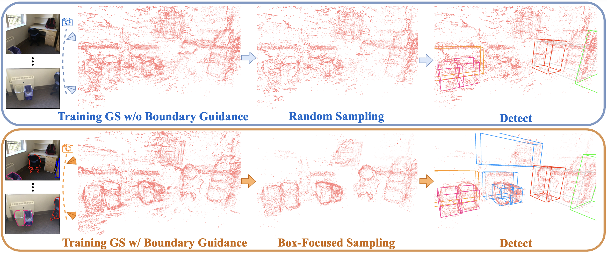
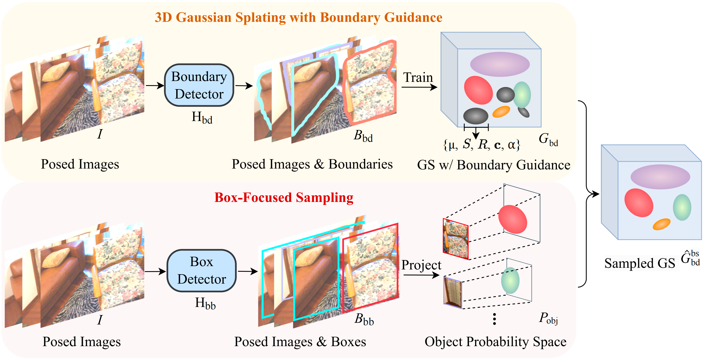
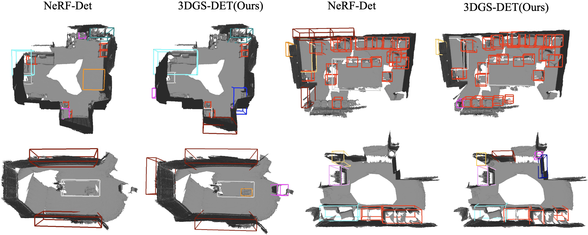
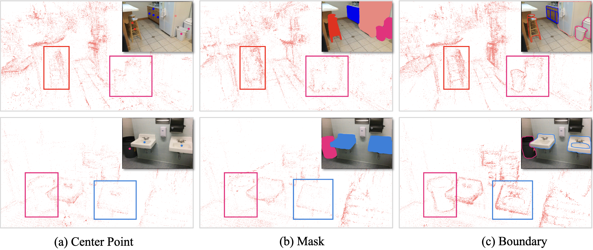
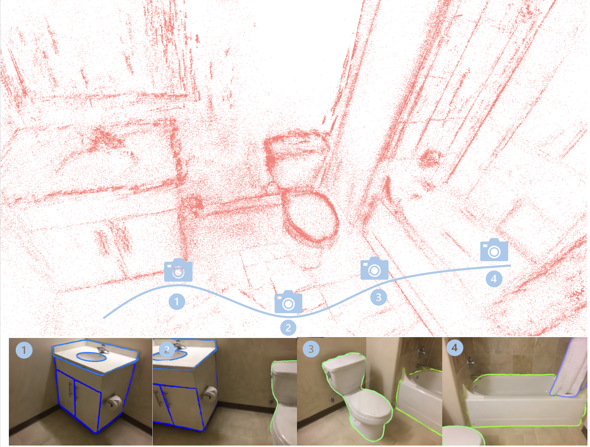

## :book: 3DGS-DET: Empower 3D Gaussian Splatting with Boundary Guidance and Box-Focused Sampling for 3D Object Detection
<p align="center">
  <small> 🔥The first work to introduce 3D Gaussian Splatting into 3D
Object Detection. ⭐Star 3DGS-DET. Thanks🔥 </small>
</p>

> [[Paper](https://arxiv.org/abs/2410.01647)] &emsp;  <br>
<!-- > [Yang Cao](https://yangcaoai.github.io/), Yihan Zeng, [Hang Xu](https://xuhangcn.github.io/), [Dan Xu](https://www.danxurgb.net) <br> -->
<!-- > The Hong Kong University of Science and Technology, Huawei Noah's Ark Lab -->
> [Yang Cao*](https://yangcaoai.github.io/), Yuanliang Ju*, [Dan Xu](https://www.danxurgb.net) <br>
> The Hong Kong University of Science and Technology<br>

:triangular_flag_on_post: **Updates**  

&#9745; Being **<a href="https://huggingface.co/papers?date=2024-10-03" style="color: #FF5733; font-weight: bold;">Top-5</a>** in Hugging Face Daily Papers!

&#9744; The code and data will be released within a month of the paper's acceptance. Please stay tuned.

&#9745; Our paper 3DGS-DET is released, check out it on [arXiv](https://arxiv.org/abs/2410.01647).

## Table of Contents
- [Boundary Guidance](#Boundary-Guidance)
- [Pipeline of 3DGS for 3D Object Detection](#Pipeline-of-3DGS-for-3D-Object-Detection)
- [Methods](#Methods)
- [Detection Samples](#Detection-Samples)
- [Guidance from Different Priors](#Guidance-from-Different-Priors)
- [Rendered Images](#Rendered-Images)
- [BibTeX](#BibTeX)
- [Contact](#Contact)
- [Acknowledgement](#Acknowledgement)
  
## Boundary Guidance



## Pipeline of 3DGS for 3D Object Detection


## Methods


## Detection Samples


## Guidance from Different Priors


## Rendered Images



## BibTeX
Cite 3DGS-DET by:
```

@misc{3dgsdet,
      title={3DGS-DET: Empower 3D Gaussian Splatting with Boundary Guidance and Box-Focused Sampling for 3D Object Detection}, 
      author={Yang Cao and Yuanliang Ju and Dan Xu},
      year={2024},
      eprint={2410.01647},
      archivePrefix={arXiv},
      primaryClass={cs.CV},
      url={https://arxiv.org/abs/2410.01647}, 
}
```

## Contact

If you have any question or collaboration needs, please email `yangcao.cs@gmail.com`.

## Acknowledgement
3DGS-DET is implemented based on [3DGS](https://github.com/graphdeco-inria/gaussian-splatting) and [MMDetection3D](https://github.com/open-mmlab/mmdetection3d). We appreciate their great codes.
